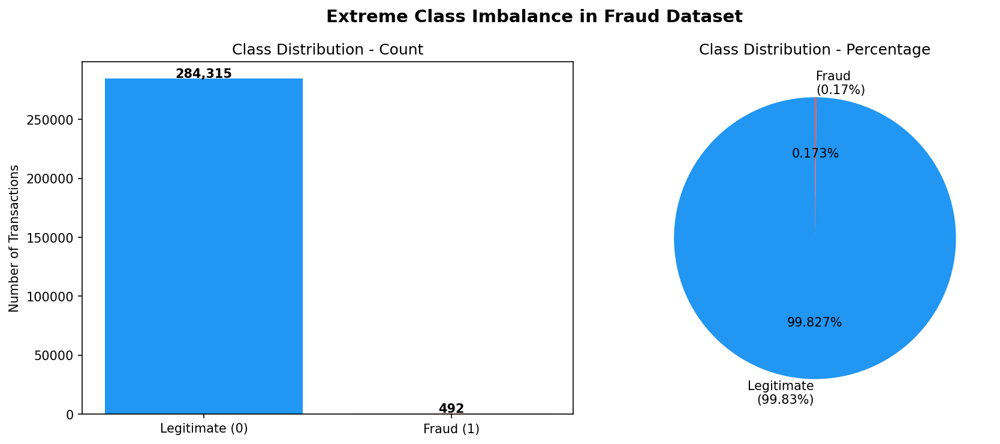
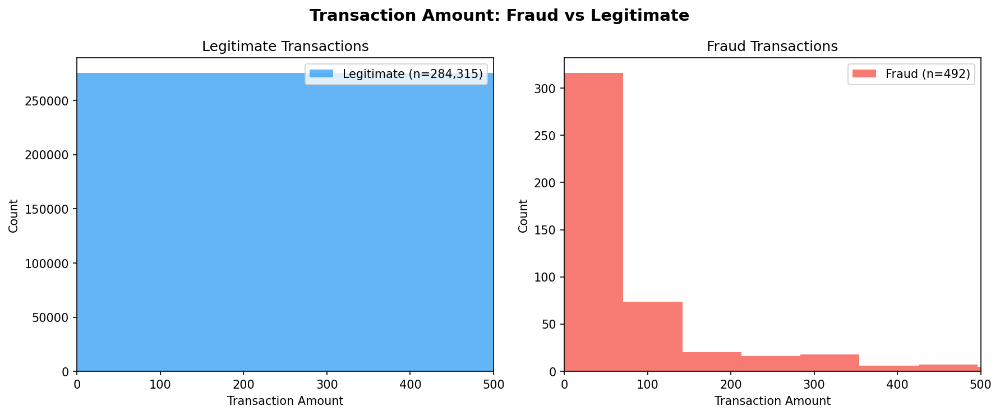
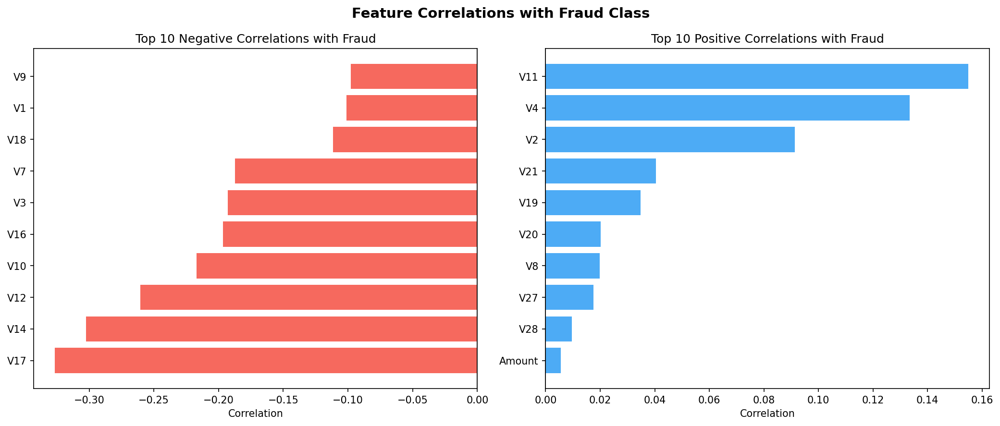
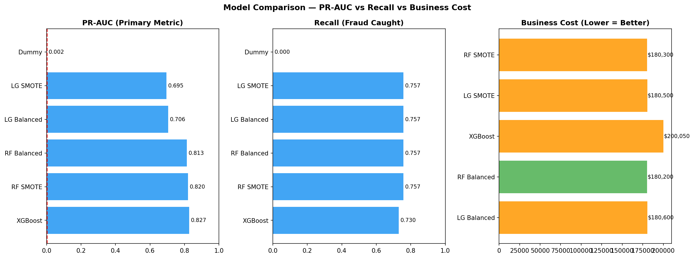
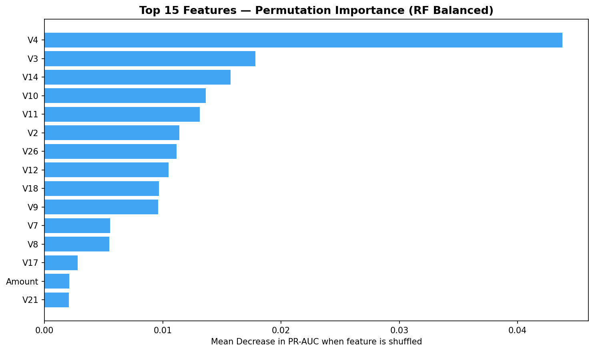

# Credit Card Fraud Detection — Cost-Sensitive ML

## Problem Statement

Detect fraudulent credit card transactions in a dataset with **0.17% fraud rate** — one of the most challenging class imbalance problems in real-world ML. The objective is not just high accuracy but **minimizing financial loss** using cost-sensitive evaluation.

---

## Dataset

- **Source:** [Kaggle — Credit Card Fraud Detection](https://www.kaggle.com/datasets/mlg-ulb/creditcardfraud)
- **Size:** 284,807 transactions
- **Fraud rate:** 0.17% (492 fraud cases out of 284,807)
- **Features:** 28 PCA-transformed features (V1-V28) + Time + Amount

> Dataset not included in repo due to size. Download from Kaggle and place in `data/` folder.

---

## Approach

### 1. Exploratory Data Analysis
Before modeling, analyzed the data to understand the imbalance and feature patterns.

**Class Imbalance:**

**Transaction Amount by Class:**

*Key finding: Fraud transactions have a median amount of just $9.25 — fraudsters make small transactions to avoid detection.*

**Feature Correlations with Fraud:**

*V17, V14, V12 are most negatively correlated with fraud. V11, V4, V2 are most positively correlated.*

### 2. Models Compared
Tested 5 approaches across 2 imbalance-handling strategies:

| Model | Imbalance Strategy |
|---|---|
| Logistic Regression | class_weight='balanced' |
| Random Forest | class_weight='balanced_subsample' |
| XGBoost | scale_pos_weight=578 |
| Logistic Regression | SMOTE oversampling |
| Random Forest | SMOTE oversampling |

### 3. Evaluation Strategy
- Primary metric: **PR-AUC** (not accuracy or ROC-AUC — both misleading on imbalanced data)
- Hyperparameter tuning: GridSearchCV scoring by `average_precision`
- Threshold tuning: manually optimized on validation set to maximize F1
- Final selection: **business cost** (FP=$50, FN=$10,000)

---

## Results

### Model Comparison

| Model | PR-AUC | Recall | Precision |
|---|---|---|---|
| **XGBoost** | **0.827** | 0.730 | **0.982** |
| RF SMOTE | 0.820 | 0.757 | 0.903 |
| RF Balanced | 0.813 | 0.757 | 0.933 |
| LG Balanced | 0.706 | 0.757 | 0.824 |
| LG SMOTE | 0.695 | 0.757 | 0.848 |
| Dummy Baseline | 0.002 | 0.000 | 0.000 |

### Cost Analysis

| Model | Business Cost |
|---|---|
| **RF Balanced** | **$180,200 ← Selected** |
| RF SMOTE | $180,300 |
| LG SMOTE | $180,500 |
| LG Balanced | $180,600 |
| XGBoost | $200,050 |

> XGBoost had the best PR-AUC but missed 2 more fraud cases than RF Balanced. At $10,000 per missed fraud, that's $20,000 more in losses — making RF Balanced the better business choice despite lower PR-AUC.

### Feature Importance

V4 was the most important feature by far — shuffling it alone dropped PR-AUC by 0.044.

---

## Key Insights

1. **Accuracy is useless here** — a model predicting "not fraud" for everything gets 99.83% accuracy
2. **PR-AUC beat ROC-AUC** as the honest metric for this imbalance level
3. **SMOTE didn't help** — class_weight='balanced' performed equally or better for both models
4. **XGBoost ≠ best model** — highest PR-AUC but highest business cost due to more missed fraud
5. **Cost-based selection changed the final decision** — metrics alone would have picked XGBoost

---

## Final Model

**Random Forest (class_weight='balanced_subsample')**
- PR-AUC: 0.813
- Recall: 75.7% (catches 3 in 4 fraud cases)
- Precision: 93.3% (when it flags fraud, it's right 93% of the time)
- Business cost: $180,200 (lowest among all models)

---

## Project Structure
